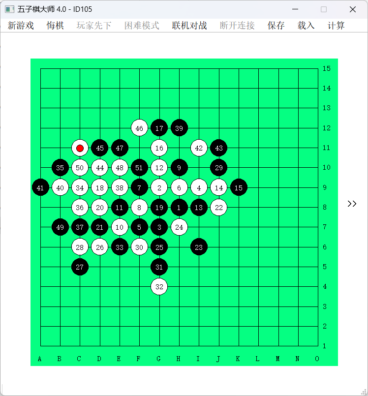

## wuziqi (五子棋/Gomoku)
A traditional board game (https://en.wikipedia.org/wiki/Gomoku) implemented using Qt framework. The application is in Chinese and there are currently no multi-language support.

### Features

- play with computer
- play with a friend
- play and chat with a friend in the same local network

### Build

Dependencies: Qt 4.8.4 and mingw4.4.

Open the .pro file in Qt creator and it should be able to build the project.

